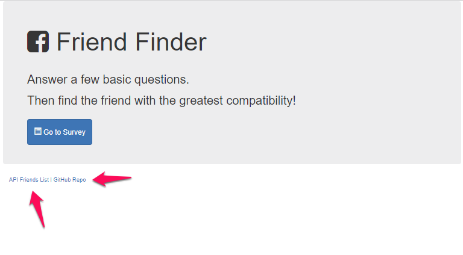

# Friend Finder

A Node.js - based matching application intended to run on Heroku.  

## Getting Started

To use, just clone down the repo, install the NPM modules, start the server, and enjoy.

### Prerequisites

Friend Finder was built and tested with the following nodeJS NPM packages:

| NPM Package     | Version |
| --------------- | ------- |
| express         | 4.16.2  |

### Installing

1. Clone the repo to your system.

1. Run `npm install`

### Starting the Server

From within the root of the project, type: `node server.js`

By default, the sever will start listening on port 3000.  If PORT is present in the environment, it will honor that port number.  This is typical when running within cloud servers like Heroku, Azure, Amazon, and so forth.

If you want the server to listen on a different port, pass the port number when starting the server like so: `PORT=9999 node server.js` 

### Usage

Launch a browser (preferably, Chrome) and direct it to your server and port (by default, `localhost:3000`).

The user is greeted by the welcome screen:

From this screen you can:

1. Chose to take the survey (by pressing the Go To Survey button),
1. See the raw list of recorded 'friends' in the database by clicking on the API Friends List hyperlink, or;
1. See the repo by clicking on the GitHub Repo hyperlink.

#### Taking the Survey

To start your survey, press the  which will send the user to a questionaire with 10 simple questions.

The user is presented with 10 characteristics assertions.  For each assertion, the user choses to agree or disagree with the assertion.  The user is also asked for his or her name as well as the path to an image of the user.  

Upon completion, the user may press the Submit button at the bottom of the survey. 

#### Results

Upon pressing Submit, our Friend Finder compares the user's selections with thos of others who have submitted their surveys.  The one on file that most closely matches the user's choices is presented to the user.

## Authors

* **Paul Rowe** - *Initial work* - [zrowe](https://github.com/zrowe)

## License

This project is licensed under the MIT License - see the [LICENSE.md](LICENSE.md) file for details

## Acknowledgments

* UC Berkeley Coding BootCamp
* Trilogy
